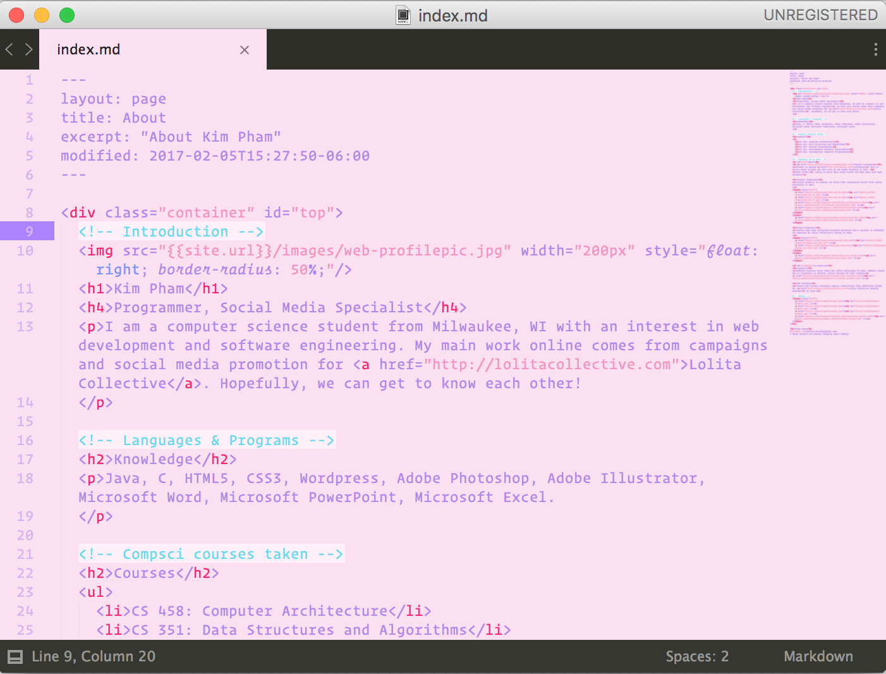

# Kawaii Pastel Aesthetics
## Sublime Text theme for kawaii people

｡･:*:･ﾟ★,｡･:*:･ﾟ☆

Cute, kawaii, and pink theme for Sublime Text, made using [tmTheme Editor](tmtheme-editor.herokuapp.com) after realizing that I could only find one cute theme for Sublime by @sailorhg [(Fairy Floss)](http://sailorhg.github.io/fairyfloss/). Not that perfect, but at least it's pink~

｡･:*:･ﾟ★,｡･:*:･ﾟ☆

# Installation
1. Download the theme [HERE]()
2. In Sublime Text, go to Preferences -> Browse Packages...
3. In the window that popped up, drag this theme into the folder.
4. Choose the theme using Preferences -> Color Scheme -> Kawaii Pastel Aesthetics
5. YOU KAWAII AS FUCK NOW, GO CODE THE NEXT BEST THING

.｡+.*.｡(❁´◡`❁)｡.｡:+*

｡･:*:･ﾟ★,｡･:*:･ﾟ☆

